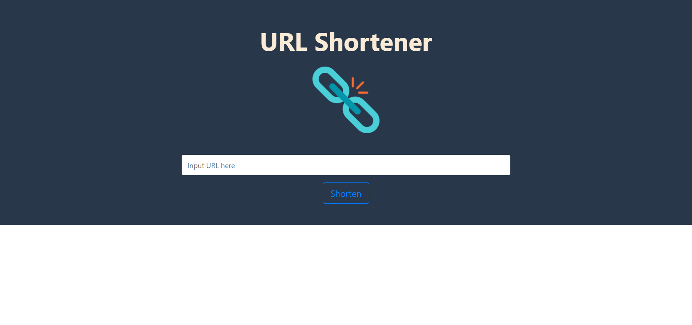

# Url Shortener

A website which could shorten the URL.

### Users could...

- shorten the URL.

- copy the short URL by click the button.

- redirect to original website by entering the short URL on the searching bar when our server is running.

  

### Getting Started

- Clone repository to your local project

```bash
git clone git@github.com:ccyang02/url-shortener.git
```

- Install dependencies

```bash
cd url-shortener
npm install
```

- Prepare your mongoDB database and make sure it is active
- Run the project and show output information on the terminal

```bash
npm run dev

> Express is listening on port 3000
```

### Built with

- Node.js: 10.16.0
- express: 4.17.1
- express-handlebars: 5.1.0
- mongoDB: 2.1.0